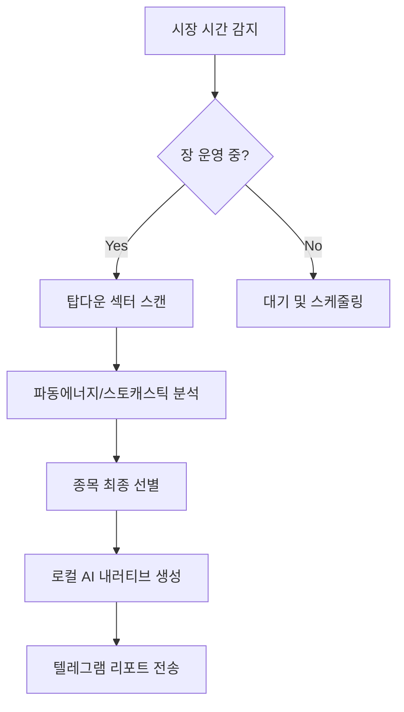

# 📈 AI Chunsik (AI 춘식) MK1.5


> **Wave Energy Theory 기반 미국 주식 자동 분석 및 텔레그램 리포팅 에이전트**

[](https://www.python.org/downloads/)
[](https://opensource.org/licenses/MIT)
[](https://ollama.ai/)

AI 춘식이는 **파동에너지 이론(Wave Energy Theory)**을 바탕으로 미국 주식 시장을 탑다운(Top-down) 방식으로 분석합니다. 로컬 LLM(Ollama)을 활용하여 정교한 투자 전략 리포트를 생성한 뒤, 텔레그램으로 자동 전송해주는 스마트한 퀀트 투자 보조 에이전트입니다.

---

## 📺 작동 메커니즘 (Analysis Pipeline)



---

## 🚀 주요 기능

- **시장 지수 스캔**: NYSE 운영 달력을 연동하여 개장/마감 시점 및 휴장일 자동 감지.
- **탑다운 섹터 분석**: 자금 유입이 강한 주도 섹터 및 종목 실시간 스크리닝.
- **파동에너지 분석**: 스토캐스틱 기반의 단/중/장기 파동 정배열 및 폭발 타점 포착.
- **AI 내러티브 생성**: 로컬 AI(Ollama)를 활용하여 팩트 기반의 투자 전략 리포트 작성.
- **텔레그램 알림**: 분석 결과를 모바일로 즉시 전송하여 빠른 의사결정 지원.
- **지능형 스케줄러**: 서머타임 및 미국 시장 휴장일(Early Close 포함) 완벽 대응.

---

## 🛠 설치 및 설정

### 1. 필수 요구사항
- **Python 3.9+**
- **[Ollama](https://ollama.ai/)**: 로컬 LLM 실행을 위해 설치가 필요합니다. (`gemma2:9b` 모델 권장)
- **Telegram Bot**: 봇 토큰과 채팅 ID가 필요합니다.

### 2. 라이브러리 설치
```bash
git clone https://github.com/casareborgia/AI-CHOONSIK-STOCK-AGENT-.git
cd AI-CHOONSIK-STOCK-AGENT-
pip install -r requirements.txt
```

### 3. 환경 설정
설정 파일 예시를 복사하여 본인의 정보를 입력하십시오.
```bash
cp config.py.example config.py
```
`config.py` 파일 내의 다음 항목을 수정하십시오:
- `TELEGRAM_BOT_TOKEN`: 텔레그램 봇 토큰
- `TELEGRAM_CHAT_ID`: 리포트를 받을 채팅 ID

---

## 🏃 실행 방법

### 단발성 분석 실행
현재 시점의 시장을 분석하고 리포트를 즉시 생성합니다.
```bash
python main_agent.py
```

### 자동 스케줄러 실행 (권장)
미국 시장 시간(개장/마감)에 맞춰 자동으로 분석을 수행합니다.
```bash
python auto_runner.py
```

---

## 📂 프로젝트 구조
- `main_agent.py`: 분석 파이프라인 총괄 엔진
- `auto_runner.py`: 시장 시간 기반 지능형 스케줄러
- `reporter.py`: 리포트 생성 및 텔레그램 전송 모듈
- `core/`: 섹터 스캔, 기술적 분석 등 핵심 로직
- `plugins/`: SNS 스캐너 등 추가 확장 모듈
- `reports/`: 생성된 마크다운 리포트 저장 폴더

---

## ⚠️ 주의사항 (Disclaimer)
본 프로그램은 알고리즘 및 기술적 분석에 기반한 **참고용 자료**를 제공할 뿐이며, 어떠한 투자 결과도 보장하지 않습니다. 모든 투자의 책임은 투자자 본인에게 있으며, 실제 거래 시 충분한 검토 후 진행하시기 바랍니다.

---

**Author**: [casareborgia](https://github.com/casareborgia)  
**License**: MIT
