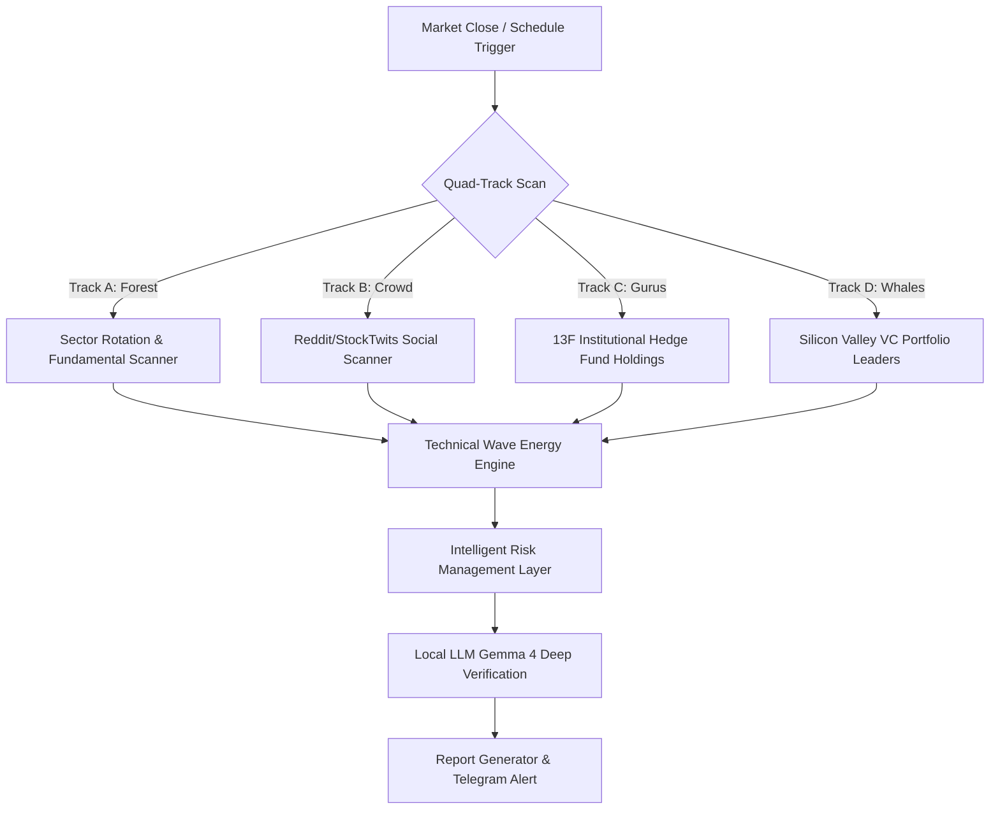

# 🚀 AI Chunsik MK1.5: Quad-Track Autonomous Quant Agent

**AI 춘식 MK1.5**는 시장의 '숫자(재무)'와 '목소리(SNS)', 그리고 '대형 자금(기관/VC)'을 동시에 다각 분석하는 하이브리드 인공지능 퀀트 투자 에이전트입니다. 단순히 차트만을 읽는 것을 넘어, 거시적 섹터 순환매부터 13F 헤지펀드 동향 및 소셜 모멘텀까지 포착하고 강력한 리스크 매니지먼트 레이어로 제어하여 최적의 스윙 타점을 도출합니다.


---

## 💡 System Architecture: The Quad-Track Pipeline

본 시스템은 **4개의 독립적인 분석 트랙(Quad-Track)**을 비동기(Asynchronous)로 병렬 실행하여 다각도로 기회를 스캔합니다.



### 🌲 Track A: Fundamental Strength (The Forest)
*   **Sector Rotation**: 11대 SPDR 섹터 ETF의 자금 흐름을 추적하여 현재 시장을 주도하는 섹터를 우선 선별합니다.
*   **Quantitative Filtering**: Finviz 고속 필터링을 거쳐 시가총액, 부채비율, FCF(잉여현금흐름) 등 우량성 기준을 충족하는 후보군을 추출합니다.

### 🚀 Track B: Social Momentum (The Crowd)
*   **3-Tier Social Scanner**: Reddit(`r/wallstreetbets`) 및 StockTwits API 실시간 데이터 피드를 비동기로 스캔하여 개인 투자자의 수급이 결집되는 핵심 티커를 포착합니다.
*   **Anti-Noise Filter**: 노이즈 단어를 차단하는 Regex 필터와 지능형 스팸 블랙리스트를 갖추고 있으며, API 제한 시 무료 스크래핑으로 자동 대체되는 중단 없는 구조를 제공합니다.

### 🏛️ Track C: Institutional Gurus (The Smart Money)
*   **13F Holdings Analyzer**: Berkshire Hathaway, Scion Asset Management, Pershing Square 등 전설적인 기관 투자자들의 분기별 공시 자료(13F)를 실시간 반영합니다.
*   **FMP & Dataroma Hybrid**: API 키 유무 및 잔여 한도에 맞춰 유료 API와 무료 정밀 스크래퍼가 유기적으로 교차 가동되는 하이브리드 수집 구조를 갖추고 있습니다.

### 💡 Track D: Venture Capital Whales (The Silicon Valley)
*   **Silicon Valley Whales Watch**: Founders Fund, Sequoia Capital, a16z 등 시장 파괴적인 성장성을 주도하는 실리콘밸리 거물 VC 포트폴리오를 추적합니다.
*   **Growth-Oriented Filters**: 적자 성장주 세그먼트를 감안하여 FCF 기준을 유연하게 적용하되, 폭발적인 추세 전환점을 타겟팅하는 특화 필터를 적용합니다.

---

## 🛡️ Intelligent Risk Management Layer (Phase 2)

MK1.5 버전에서 새롭게 보강된 **초정밀 리스크 방어망**은 기술적 돌파 시그널의 왜곡을 방지하고 포트폴리오의 안정성을 기관급으로 격상시킵니다.

1.  **변동성(Beta) 기반 동적 손절 수칙 (Dynamic Stop-Loss)**
    *   Yahoo Finance에서 종목별 체계적 위험(`beta`)을 수집하여 `stop_loss_pct = round(max(5.0, min(12.0, 5.0 * beta)))` 공식에 따라 **-5%에서 최대 -12%까지** 동적 손절선을 자동 부과합니다.
2.  **재무-시그널 괴리 오케스트레이터 (Autopilot Valuation Downgrader)**
    *   기술적 지표가 "강력매수"일지라도 밸류에이션 과열 임계치(전통 섹터 P/E > 40, 테크 섹터 P/E > 100, PEG > 2.5)를 초과하는 종목은 즉시 **`⚠️ 기술적 돌파이나 재무적 고평가 주의 (시그널)`**로 등급을 자동 격하합니다.
3.  **퀀트 트리플 내러티브 검증 지침**
    *   **이익의 질(Earnings Quality)**: 이익 압착(Earnings Compression) 기저효과에 의해 P/E, PEG 수치가 착시를 불러일으키는 밸류에이션 함정을 선별합니다.
    *   **공매도 이중 대차 착시**: 기관 지분율이 100%를 초과하는 비정상적인 종목 포착 시, 주식 대차 거래로 생기는 '숏인터레스트(Short Interest) 착시'를 규명하여 수급 왜곡을 경고합니다.
    *   **유동성 고점 drift**: 52주 고점 위치에서의 저거래량 흐름을 상방 소진 및 유동성 고갈 리스크 관점으로 냉철하게 평가합니다.
4.  **포트폴리오 섹터 집중도 경고 시스템**
    *   동일 섹터 종목이 3개 이상 포착될 경우 리포트 상단에 동적으로 **GitHub Alerts 경고 배지(`> [!WARNING]`)**를 삽입하여 포트폴리오의 분산 투자를 보좌합니다.
5.  **동적 리포트 서브 폴더링 및 자동 정돈 (Dynamic Organizer)**
    *   리포트가 무한히 쌓여 난잡해지는 현상을 막기 위해 실행 시점 기준 **`연도-분기-월 (예: 2026년-2분기-5월)`** 디렉토리를 자동 생성하고 수납합니다.
    *   메인 `reports/` 폴더에 방치된 레거시 리포트들을 폴더 생성 즉시 알아서 수집 및 이동 수납하는 인텔리전트 마이그레이션(`migrate_legacy_reports`) 로직이 내장되어 있습니다.

---

## ⚙️ Core Modules & Wave Theory

*   **Technical Engine (Wave Energy)**: 
    *   스토캐스틱 대/중/소 파동에너지 지표의 정배열 및 다중 골든크로스를 감지하여 상방 에너지를 판단합니다.
    *   20일 평균 거래량 대비 **1.2배 이상**의 거래량 폭발을 필수 동반 타점으로 요구합니다.
*   **AI Verification (Local Gemma 4)**: 
    *   로컬 Ollama를 연동하여 **Gemma 4:26b** 모델로 가치, 수급, 뉴스 모멘텀을 결합한 비판적인 퀀트 검증을 최종 수행합니다.

---

## 🛠 Installation & Setup

### Prerequisites
*   Python 3.9+
*   [Ollama](https://ollama.ai/) (로컬 `gemma4:26b` 또는 원하는 로컬 LLM 모델 설치)
*   텔레그램 봇 토큰 및 수신용 Chat ID (선택 사항)

### Setup
```bash
# 1. 저장소 클론
git clone https://github.com/casareborgia/AI-CHOONSIK-STOCK-AGENT-.git
cd AI-CHOONSIK-STOCK-AGENT-

# 2. 필수 라이브러리 설치
pip install -r requirements.txt

# 3. 환경 변수 설정
# 프로젝트 루트에 .env 파일을 생성하고 아래 양식으로 채워 넣습니다.
# FMP_API_KEY가 없거나 미설정 시 무료 Dataroma 스크래핑 엔진으로 자동 폴백 구동됩니다.
TELEGRAM_BOT_TOKEN="여기에 텔레그램 봇 토큰 입력"
TELEGRAM_CHAT_ID="여기에 수신할 챗 ID 입력"
FMP_API_KEY="여기에 FMP API 키 입력 (선택)"
```

### Usage
```bash
# 퀀트 스캐너 및 AI 리포터 파이프라인 수동 즉시 구동
python main_agent.py

# 스마트 머니 와치리스트 (Track C/D) 최신 holdings 정보 실시간 업데이트
python update_watchlist.py
```

---

## ⚠️ Disclaimer
본 프로젝트는 학습 및 퀀트 정보 제공을 목적으로 개발된 오픈소스 에이전트입니다. 모든 투자에 대한 최종 결정과 책임은 투자자 본인에게 있으며, AI의 분석 결과와 리스크 모델링 수치가 어떠한 주식 시장의 수익률도 확정적으로 보장하지 않습니다.
