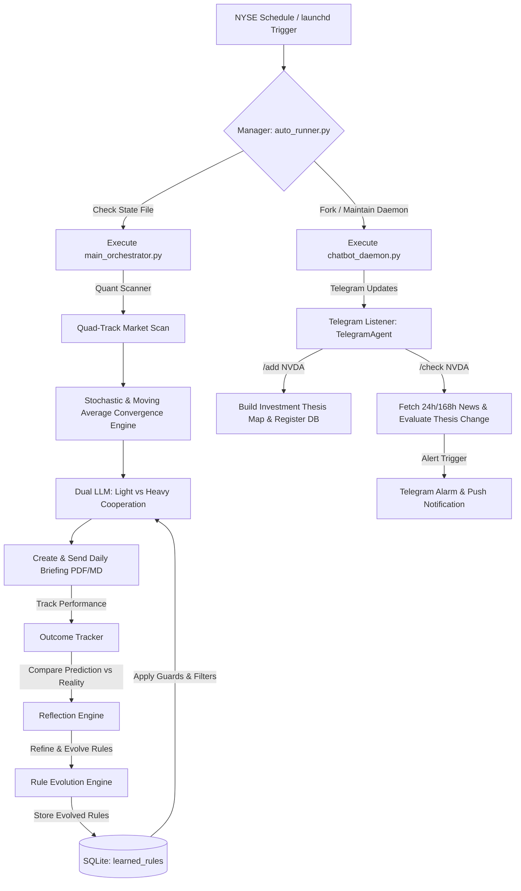

# 🚀 AI Chunsik MK4: Dual-LLM Autonomous Portfolio Thesis Agent

**AI 춘식 MK4**는 시장의 핵심 지표(재무, 수급, 기술적 타점) 분석을 바탕으로 로컬 **듀얼 LLM(Dual-LLM)** 협동 아키텍처를 가동하여 투자 포트폴리오의 **Thesis Map(투자 가설)**을 스스로 수립하고, 24시간 실시간 뉴스 모멘텀을 감시하여 투자 가설 훼손(Kill Condition) 여부를 실시간으로 판별 및 경고하는 상시 밀착형 지능형 퀀트 투자 에이전트입니다.

특히, 예측 성과와 실제 수익률 피드백을 비교 분석하여 스스로 규칙을 수정 및 정교화하는 **자가학습(Self-Learning & Evolution) 피드백 루프**를 장착하고 있습니다.


---

## 💡 System Architecture: The Thesis & Self-Learning Pipeline

본 시스템은 **4대 분석 트랙(Quad-Track)**을 기반으로 유망 종목을 스캔하고, 획득한 타점 후보군에 대해 투자 아이디어를 작성하며, 24시간 백그라운드 데몬이 뉴스 피드를 수집하여 기존 투자 가설에 훼손이 생겼는지 추적 분석합니다. 또한 성과 피드백을 축적하여 룰을 자가 진화시킵니다.



---

## ✨ AI 춘식 MK4 핵심 개선 사항 (Key Features)

### 🛡️ 0. 가짜 데이터 차단 및 실효적 자가학습 (MK4 개편 사항)
*   **가짜 데이터 차단 및 Provenance 추적**: LLM이나 네트워크 장애 시 하드코딩된 수치로 리포트를 생성하지 않으며, 데이터 출처 신뢰성을 입증하는 `Provenance` 모듈을 도입했습니다. 데이터 누락 또는 LLM 응답 불가 시 `is_degraded`로 마킹하여 학습 DB 격리 및 최종 보고서 상단에 오염 차단 경고 배너를 강제 렌더링합니다.
*   **통계적 규칙 백테스팅 게이트**: 자가학습 시 무작위로 규칙을 양산하는 것을 차단하기 위해, 과거 200여 개의 결정 흔적(`decision_traces`) 데이터를 연계한 **부트스트랩 95% 신뢰구간(Bootstrap 95% CI) 백테스터 게이트**를 이식하여 통계적으로 검증된 유효 규칙만 적재합니다.
*   **Shadow/Active 룰 라이프사이클 관리**: 신규 진화된 룰은 즉시 반영되지 않고 `Shadow` 단계로 기입되어 성과 추적 후 95% 신뢰구간을 넘어서야 `Active`로 승격되고, 저성과 지속 시 퇴출되는 라이프사이클 시스템을 도입했습니다.


### 📡 1. 토스증권 API 실시간 시세 연동 및 yfinance 이중화 폴백 (Toss Securities API Integration)
*   **실시간 수급 정보**: `.env`에 정의된 `TOSS_CLIENT_ID` 및 `TOSS_CLIENT_SECRET`를 참조하여 실시간으로 OAuth2 토큰을 발급/갱신하고 시세를 조회하는 [toss_client.py](file:///Users/leeseungjun/coding/%ED%88%AC%EC%9E%90%20%EC%9D%98%EC%82%AC%EA%B2%B0%EA%B2%B0%EC%A0%95%20%EB%B3%B4%EC%A1%B0%20%EC%8B%9C%EC%8A%A4%ED%85%9C%20%EC%B6%98%EC%8B%9D%20MK3/core/toss_client.py)를 신설했습니다.
*   **하이브리드 시세 수집**: 국내 서학개미들의 실시간 투자 동향을 분석하기 위해 토스증권 시세를 우선적으로 참조하며, API 차단이나 네트워크 예외 발생 시 기존의 `yfinance` 모듈로 유연하게 전환(Fallback)되는 안전 설계를 갖추고 있습니다.

### 2. 🤖 듀얼 LLM 협동 아키텍처 (Dual-LLM Architecture)
*   **역할 분담 및 효율화**: 
    *   **Light LLM (`gemma4` 등)**: 가벼운 데이터 포맷 검증, 단순 1차 팩트 체크 및 JSON 교정 등의 태스크를 고속 처리하여 레이턴시와 리소스를 절감합니다.
    *   **Heavy LLM (`gemma4:26b` 등)**: 심층 재무 및 소셜 감성 융합 분석, 실시간 뉴스 기반 투자 가설(Thesis) 평가, 최종 리포트 내러티브 작성 등의 복잡한 논리 추론 작업을 심도 있게 담당합니다.

### 💬 3. 에이전트 간 1:1 비동기 채팅 체인 (Chat Chain) 및 메모리 다이어트 (Memory Diet)
*   **Shared Memory & Payload Referencing**: 에이전트 간 대규모 데이터를 중복 교환하여 토큰이 낭비되고 병목이 생기는 현상을 차단하기 위해, 메시지 버스에 인메모리 `shared_memory`를 도입했습니다. 에이전트들은 데이터의 해시 태그(`#payload:debate:TICKER`)만 교환하고 실제 데이터는 메모리에서 참조함으로써 속도를 크게 향상시켰습니다.
*   **1:1 토론 체인**: `ThesisAgent`와 `CriticAgent`가 비동기적으로 소통하며, 1차 투자 아이디어와 실시간 수급 지표 사이의 모순점을 짚어내고 최종 성찰(Reconciliation)을 통해 가설을 정교화합니다. 불일치가 없을 경우 조기 정지(Early Stopping) 프로토콜을 가동해 리소스를 아낍니다.
*   **메모리 자동 만료 및 정리**: 파이프라인 가동 완료 시 `cleanup_stale_payloads(max_age=0)` 호출을 통해 공유 메모리 데이터를 완전히 GC 처리하는 메모리 최적화를 이식했습니다.

### 🔄 4. 피드백 기반 자가학습 및 규칙 진화 엔진 (Self-Learning Loop)
과거의 분석 판단이 맞았는지 틀렸는지를 주가 흐름 피드백으로 검증하여 투자 규칙을 스스로 진화시키는 학습 체계를 내장하고 있습니다.
*   **성과 추적 (`outcome_tracker.py`)**: 이전에 발굴한 종목의 추천 가격과 5/10/20 영업일 경과 후의 실제 수익률 데이터를 추적하여 기록합니다.
*   **성찰 엔진 (`reflection_engine.py`)**: 과거 추천 사유와 실제 주가 흐름을 대조 분석하고, 예측 실패 원인을 성찰(Reflection)하여 SQLite `learned_rules` 테이블에 저장 및 진화시킵니다.
*   **SSRF 및 비동기 안정화**: 파이썬 3.9 이하의 비동기 세마포어 에러를 방지하기 위해 지연(lazy) 세마포어 바인딩을 적용했으며, 도메인 화이트리스트 검사기(`validate_url`)를 통해 외부 URL 요청 시 일어날 수 있는 SSRF 공격 리스크를 예방합니다.

### 📡 5. 24시간 대화형 챗봇 데몬 (`chatbot_daemon.py`)
텔레그램 메신저를 통해 실시간으로 챗봇과 소통하며 관심 종목을 추가하고 실시간 Thesis 훼손 검사를 명령할 수 있습니다.
*   **`/add [티커]`**: yfinance 데이터 및 로컬 AI 분석을 거쳐 해당 종목의 **투자 Thesis, 핵심 지표, 촉매, 리스크, Kill Condition(매도 조건), 소음 필터(Noise Rules)** 등을 자동으로 작성하여 DB에 등록합니다.
*   **`/check [티커]`**: 최근 24시간~최대 7일간 발생한 해당 종목의 뉴스 및 공시를 실시간 크롤링하여, **기존에 수립된 투자 가설과 매도 조건에 부정적인 변화가 일어났는지**를 AI가 교차 분석하여 변화 브리핑을 즉각 보고합니다.
*   **`/list` / `/del [티커]`**: 현재 춘식이가 24시간 밀착 감시 중인 보유 종목 목록을 조회하거나 삭제합니다.
*   **🚫 보안 입력 검증 및 자원 보호**: 입력 명령어에 영문 1~5자리 정규식 검증(Regex Validation)을 이식하여 유해 텍스트 입력으로 인한 로컬 LLM 과부하 DoS 공격을 방어합니다.

### ⏰ 4. 상태 기반 결함 감내 자동화 스케줄러 (`auto_runner.py`)
*   **스마트 세션 감지**: NYSE 미국 주식시장 캘린더(`exchange_calendars`)와 안전하게 연동되어 주말/공휴일 예외를 회피하며, 장 시작(시가 분석) 및 장 마감(종가 분석) 시점에 정확히 보고서를 발송합니다.
*   **`run_state.json` 상태 기계**: 맥미니 가동 도중 절전 모드로 진입하거나 예상치 못한 전원 꺼짐 현상이 발생하더라도, 재가동 즉시 상태 파일을 확인하여 누락되었던 직전 분석 세션을 자동으로 찾아내 보완 실행(Fault Tolerance)합니다.
*   **챗봇 데몬 자가 치유(Heartbeat)**: 1시간에 한 번씩 하위 프로세스인 챗봇 리스너 데몬의 생존 여부를 모니터링하여, 예기치 않게 프로세스가 죽어있는 경우 자동으로 재기동합니다.

### 📈 5. 리스크 관리 레이어 및 이평선 수렴 분석 보강 (`technical_engine.py`)
*   **유동성 및 수렴 분석**: 스토캐스틱 파동 외에도 60일, 120일선 등 장기 이동평균선 정배열/역배열을 판별하고 편차를 분석하여, 에너지가 응축된 수렴 구간과 이격 과열 구간을 감지합니다.
*   **리스크 프로파일 연동**: `config.py`의 `USER_RISK_PROFILE` 설정(보수/균형/공격)에 부합하도록 밸류에이션(P/E, PEG) 가드레일을 통제하여 투자 안정성을 높였습니다.

---

## 🛠 Installation & Setup

### Prerequisites
*   Python 3.9+
*   [Ollama](https://ollama.ai/) (로컬 `gemma4` 및 `gemma4:26b` 모델 설치)
*   텔레그램 봇 토큰 및 수신용 Chat ID (선택 사항)

### Setup
```bash
# 1. 저장소 클론
git clone https://github.com/casareborgia/AI-CHOONSIK-STOCK-AGENT-.git
cd AI-CHOONSIK-STOCK-AGENT-

# 2. 필수 라이브러리 설치
pip install -r requirements.txt

# 3. 환경 변수 설정 (.gitignore로 유출 방지 처리됨)
# 프로젝트 루트에 .env 파일을 생성하고 아래 형식으로 채워 넣습니다.
TELEGRAM_BOT_TOKEN="여기에 텔레그램 봇 토큰 입력"
TELEGRAM_CHAT_ID="여기에 수신할 챗 ID 입력"
FMP_API_KEY="선택 사항: FMP API 키 (없을 경우 Dataroma로 자동 폴백)"
```

### Usage

#### 1. 24시간 스케줄러 & 챗봇 통합 기동
맥미니에서 상시 가동 스케줄러 및 실시간 챗봇을 백그라운드로 구동하려면 아래 스크립트를 실행합니다.
```bash
# launchd 서비스 등록 및 백그라운드 기동
chmod +x register_service.sh start_chunsik.command
./register_service.sh
```

#### 2. 수동 강제 분석 및 1회성 테스트
```bash
# 퀀트 스캔 및 AI 리포터 즉시 수동 구동
python main_orchestrator.py

# 텔레그램 챗봇 리스너 데몬만 단독 구동
python chatbot_daemon.py
```

---

## ⚠️ Disclaimer
본 프로젝트는 개인의 학습 및 퀀트 정보 제공을 목적으로 개발된 오픈소스 에이전트입니다. 모든 투자에 대한 최종 결정과 책임은 투자자 본인에게 있으며, AI의 분석 결과와 리스크 모델링 수치가 어떠한 주식 시장의 수익률도 확정적으로 보장하지 않습니다.
